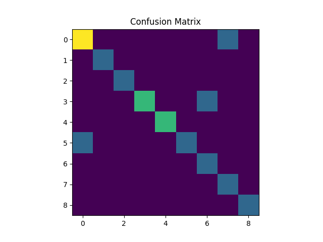
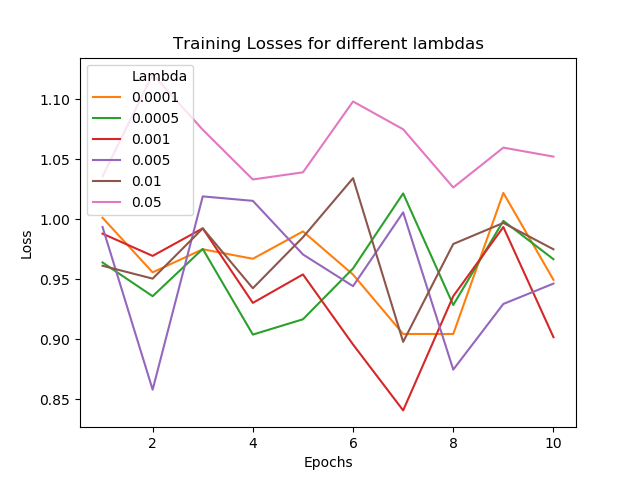
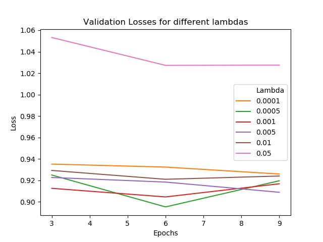
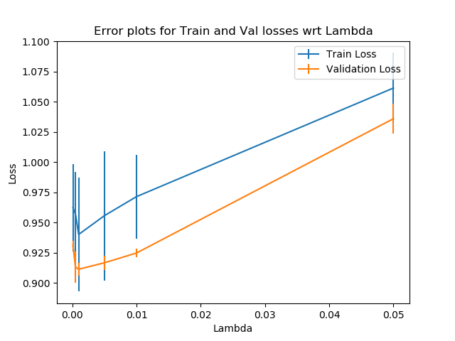

# Finetuning
## Rubric
The finetuning part of the assignment asks us to finetune the model and apply L2 regularization. Formally this part of the assignment asks us to do the following tasks:

1. Run validation of the model every few training epochs on validation or test set of the dataset and save the model with the best validation error.
2. Try applying $L2$ regularization to the coefficients in the small networks we added.

## My Implementation
- I converted the code to be run on a GPU (if there is one) and the speed of execution is significant.
- After this, I added a for loop, outside of the iterator `for loop (epochs)`, which iterates over the list of common $\lambda$ s, and a new optimizer is employed for every 10 epochs (with varying values of $\lambda$ ). $\lambda s = [0.0001, 0.0005, 0.001, 0.005, 0.01, 0.05]$ .
- There is a validation loop (doesn't contribute to training) that happens after every 3 epochs and the best model is saved based on the validation loss calculated in this validation loop.
- For every epoch (training and validation) the loss values are saved in a `pickle file`.
- Training and Validation Losses are plotted using `matplotlib`.
- After this step the model was tested using the test set.
    - For the testing part the probabilities, confusion matrix, and individual accuracies are also reported in this README.

## Losses
These are the losses that I got on the CIFAR dataset. `train_loss_hist` and `val_loss_hist` are python dictionaries which contain the losses for every lambda for every epoch.

```python
train_df = pd.DataFrame.from_dict(train_loss_hist)
val_df = pd.DataFrame.from_dict(val_loss_hist)
print(train_df.to_markdown())
print(val_df.to_markdown())
```

### Training Loss
|    |   0.0001 |   0.0005 |    0.001 |    0.005 |     0.01 |    0.05 |
|---:|---------:|---------:|---------:|---------:|---------:|--------:|
|  0 | 1.00116  | 0.963978 | 0.987946 | 0.993469 | 0.961235 | 1.03562 |
|  1 | 0.955762 | 0.935897 | 0.969453 | 0.858121 | 0.950535 | 1.12053 |
|  2 | 0.974967 | 0.975258 | 0.992388 | 1.01898  | 0.992314 | 1.07448 |
|  3 | 0.967047 | 0.903952 | 0.930338 | 1.01527  | 0.942524 | 1.03307 |
|  4 | 0.989834 | 0.916697 | 0.954009 | 0.970647 | 0.984969 | 1.03901 |
|  5 | 0.953899 | 0.959029 | 0.89568  | 0.944263 | 1.03414  | 1.09799 |
|  6 | 0.90446  | 1.02146  | 0.840842 | 1.0057   | 0.897882 | 1.07483 |
|  7 | 0.904433 | 0.92859  | 0.935928 | 0.87479  | 0.979364 | 1.0264  |
|  8 | 1.0219   | 0.998607 | 0.99348  | 0.929463 | 0.99692  | 1.05957 |
|  9 | 0.949547 | 0.966687 | 0.901809 | 0.946391 | 0.974945 | 1.0521  |

### Validation Loss
|    |   0.0001 |   0.0005 |    0.001 |    0.005 |     0.01 |    0.05 |
|---:|---------:|---------:|---------:|---------:|---------:|--------:|
|  3 | 0.935228 | 0.925057 | 0.912652 | 0.922772 | 0.929324 | 1.05322 |
|  6 | 0.932447 | 0.895333 | 0.904639 | 0.91848  | 0.921074 | 1.02728 |
|  9 | 0.92598  | 0.919693 | 0.916896 | 0.908959 | 0.924115 | 1.02749 |

### Testing
While testing I got this accuracy and loss.
- Accuracy: 81.25 %
- Final Loss: 0.867263

#### Probabilities
For probabilities, I applied Softmax to the output so that all of the values from a single prediction add up to 1.00. The highest value is indeed the prediction of the model (highlighted cell in the table below). The reason I had to apply Softmax only for testing phase, and not for training and validation, is because of the Loss function we are using, i.e., `nn.CrossEntropyLoss()`. This function, for PyTorch applies softmax internally, hence I did not add a `nn.functional.softmax()` to the fully-connected layer 'fc' in the model (This would have been applied if it were Tensorflow/Keras). I applied Softmax only to report the probabilities (which are in the table below).

The following snippet of code highlights the DataFrame's, containing the prediction values (with softmax applied) highest values (for each row) and saves the DataFrame in an html file, `test.html`. The output of `test.html` is provided below.

```python
df = pd.DataFrame(probs, index=labs, columns=cifar_classes)
with open(os.path.join("models", "test.html"), 'w') as f:
	f.write(df.reset_index().style.highlight_max(color="yellow", axis=1).render())
```

<style  type="text/css" >
	#T_34f3c_row0_col8,#T_34f3c_row1_col3,#T_34f3c_row2_col2,#T_34f3c_row3_col4,#T_34f3c_row4_col8,#T_34f3c_row5_col5,#T_34f3c_row6_col2,#T_34f3c_row7_col6,#T_34f3c_row8_col7,#T_34f3c_row9_col6,#T_34f3c_row10_col9,#T_34f3c_row11_col5,#T_34f3c_row12_col10,#T_34f3c_row13_col9,#T_34f3c_row14_col2,#T_34f3c_row15_col2{
		background-color:  yellow;
	}
</style>
<table id="T_34f3c_" >
	<thead>    <tr>        <th class="blank level0" ></th>        <th class="col_heading level0 col0" >index</th>        <th class="col_heading level0 col1" >plane</th>        <th class="col_heading level0 col2" >car</th>        <th class="col_heading level0 col3" >bird</th>        <th class="col_heading level0 col4" >cat</th>        <th class="col_heading level0 col5" >deer</th>        <th class="col_heading level0 col6" >dog</th>        <th class="col_heading level0 col7" >frog</th>        <th class="col_heading level0 col8" >horse</th>        <th class="col_heading level0 col9" >ship</th>        <th class="col_heading level0 col10" >truck</th>    </tr>
	</thead>
	<tbody>
		<tr>
			<th id="T_34f3c_level0_row0" class="row_heading level0 row0" >0</th>
			<td id="T_34f3c_row0_col0" class="data row0 col0" >horse</td>
			<td id="T_34f3c_row0_col1" class="data row0 col1" >0.044098</td>
			<td id="T_34f3c_row0_col2" class="data row0 col2" >0.028238</td>
			<td id="T_34f3c_row0_col3" class="data row0 col3" >0.070636</td>
			<td id="T_34f3c_row0_col4" class="data row0 col4" >0.073138</td>
			<td id="T_34f3c_row0_col5" class="data row0 col5" >0.144377</td>
			<td id="T_34f3c_row0_col6" class="data row0 col6" >0.031109</td>
			<td id="T_34f3c_row0_col7" class="data row0 col7" >0.001827</td>
			<td id="T_34f3c_row0_col8" class="data row0 col8" >0.425052</td>
			<td id="T_34f3c_row0_col9" class="data row0 col9" >0.010873</td>
			<td id="T_34f3c_row0_col10" class="data row0 col10" >0.170652</td>
		</tr>
		<tr>
			<th id="T_34f3c_level0_row1" class="row_heading level0 row1" >1</th>
			<td id="T_34f3c_row1_col0" class="data row1 col0" >bird</td>
			<td id="T_34f3c_row1_col1" class="data row1 col1" >0.000732</td>
			<td id="T_34f3c_row1_col2" class="data row1 col2" >0.000561</td>
			<td id="T_34f3c_row1_col3" class="data row1 col3" >0.655634</td>
			<td id="T_34f3c_row1_col4" class="data row1 col4" >0.077678</td>
			<td id="T_34f3c_row1_col5" class="data row1 col5" >0.158468</td>
			<td id="T_34f3c_row1_col6" class="data row1 col6" >0.081604</td>
			<td id="T_34f3c_row1_col7" class="data row1 col7" >0.003284</td>
			<td id="T_34f3c_row1_col8" class="data row1 col8" >0.018543</td>
			<td id="T_34f3c_row1_col9" class="data row1 col9" >0.002086</td>
			<td id="T_34f3c_row1_col10" class="data row1 col10" >0.001410</td>
		</tr>
		<tr>
			<th id="T_34f3c_level0_row2" class="row_heading level0 row2" >2</th>
			<td id="T_34f3c_row2_col0" class="data row2 col0" >car</td>
			<td id="T_34f3c_row2_col1" class="data row2 col1" >0.108216</td>
			<td id="T_34f3c_row2_col2" class="data row2 col2" >0.744466</td>
			<td id="T_34f3c_row2_col3" class="data row2 col3" >0.002983</td>
			<td id="T_34f3c_row2_col4" class="data row2 col4" >0.000050</td>
			<td id="T_34f3c_row2_col5" class="data row2 col5" >0.000562</td>
			<td id="T_34f3c_row2_col6" class="data row2 col6" >0.000048</td>
			<td id="T_34f3c_row2_col7" class="data row2 col7" >0.011904</td>
			<td id="T_34f3c_row2_col8" class="data row2 col8" >0.000213</td>
			<td id="T_34f3c_row2_col9" class="data row2 col9" >0.090366</td>
			<td id="T_34f3c_row2_col10" class="data row2 col10" >0.041193</td>
		</tr>
		<tr>
			<th id="T_34f3c_level0_row3" class="row_heading level0 row3" >3</th>
			<td id="T_34f3c_row3_col0" class="data row3 col0" >cat</td>
			<td id="T_34f3c_row3_col1" class="data row3 col1" >0.003881</td>
			<td id="T_34f3c_row3_col2" class="data row3 col2" >0.000201</td>
			<td id="T_34f3c_row3_col3" class="data row3 col3" >0.036848</td>
			<td id="T_34f3c_row3_col4" class="data row3 col4" >0.627690</td>
			<td id="T_34f3c_row3_col5" class="data row3 col5" >0.000426</td>
			<td id="T_34f3c_row3_col6" class="data row3 col6" >0.216069</td>
			<td id="T_34f3c_row3_col7" class="data row3 col7" >0.000021</td>
			<td id="T_34f3c_row3_col8" class="data row3 col8" >0.004635</td>
			<td id="T_34f3c_row3_col9" class="data row3 col9" >0.016958</td>
			<td id="T_34f3c_row3_col10" class="data row3 col10" >0.093273</td>
		</tr>
		<tr>
			<th id="T_34f3c_level0_row4" class="row_heading level0 row4" >4</th>
			<td id="T_34f3c_row4_col0" class="data row4 col0" >deer</td>
			<td id="T_34f3c_row4_col1" class="data row4 col1" >0.000188</td>
			<td id="T_34f3c_row4_col2" class="data row4 col2" >0.000378</td>
			<td id="T_34f3c_row4_col3" class="data row4 col3" >0.069593</td>
			<td id="T_34f3c_row4_col4" class="data row4 col4" >0.051427</td>
			<td id="T_34f3c_row4_col5" class="data row4 col5" >0.271371</td>
			<td id="T_34f3c_row4_col6" class="data row4 col6" >0.106221</td>
			<td id="T_34f3c_row4_col7" class="data row4 col7" >0.098342</td>
			<td id="T_34f3c_row4_col8" class="data row4 col8" >0.400993</td>
			<td id="T_34f3c_row4_col9" class="data row4 col9" >0.000014</td>
			<td id="T_34f3c_row4_col10" class="data row4 col10" >0.001472</td>
		</tr>
		<tr>
			<th id="T_34f3c_level0_row5" class="row_heading level0 row5" >5</th>
			<td id="T_34f3c_row5_col0" class="data row5 col0" >deer</td>
			<td id="T_34f3c_row5_col1" class="data row5 col1" >0.040856</td>
			<td id="T_34f3c_row5_col2" class="data row5 col2" >0.000023</td>
			<td id="T_34f3c_row5_col3" class="data row5 col3" >0.080293</td>
			<td id="T_34f3c_row5_col4" class="data row5 col4" >0.001890</td>
			<td id="T_34f3c_row5_col5" class="data row5 col5" >0.812849</td>
			<td id="T_34f3c_row5_col6" class="data row5 col6" >0.000946</td>
			<td id="T_34f3c_row5_col7" class="data row5 col7" >0.000855</td>
			<td id="T_34f3c_row5_col8" class="data row5 col8" >0.062225</td>
			<td id="T_34f3c_row5_col9" class="data row5 col9" >0.000057</td>
			<td id="T_34f3c_row5_col10" class="data row5 col10" >0.000006</td>
		</tr>
		<tr>
			<th id="T_34f3c_level0_row6" class="row_heading level0 row6" >6</th>
			<td id="T_34f3c_row6_col0" class="data row6 col0" >car</td>
			<td id="T_34f3c_row6_col1" class="data row6 col1" >0.006504</td>
			<td id="T_34f3c_row6_col2" class="data row6 col2" >0.974094</td>
			<td id="T_34f3c_row6_col3" class="data row6 col3" >0.000034</td>
			<td id="T_34f3c_row6_col4" class="data row6 col4" >0.000014</td>
			<td id="T_34f3c_row6_col5" class="data row6 col5" >0.000001</td>
			<td id="T_34f3c_row6_col6" class="data row6 col6" >0.000103</td>
			<td id="T_34f3c_row6_col7" class="data row6 col7" >0.000010</td>
			<td id="T_34f3c_row6_col8" class="data row6 col8" >0.000122</td>
			<td id="T_34f3c_row6_col9" class="data row6 col9" >0.001145</td>
			<td id="T_34f3c_row6_col10" class="data row6 col10" >0.017972</td>
		</tr>
		<tr>
			<th id="T_34f3c_level0_row7" class="row_heading level0 row7" >7</th>
			<td id="T_34f3c_row7_col0" class="data row7 col0" >dog</td>
			<td id="T_34f3c_row7_col1" class="data row7 col1" >0.010873</td>
			<td id="T_34f3c_row7_col2" class="data row7 col2" >0.000259</td>
			<td id="T_34f3c_row7_col3" class="data row7 col3" >0.120890</td>
			<td id="T_34f3c_row7_col4" class="data row7 col4" >0.175210</td>
			<td id="T_34f3c_row7_col5" class="data row7 col5" >0.026569</td>
			<td id="T_34f3c_row7_col6" class="data row7 col6" >0.574630</td>
			<td id="T_34f3c_row7_col7" class="data row7 col7" >0.003316</td>
			<td id="T_34f3c_row7_col8" class="data row7 col8" >0.087592</td>
			<td id="T_34f3c_row7_col9" class="data row7 col9" >0.000510</td>
			<td id="T_34f3c_row7_col10" class="data row7 col10" >0.000151</td>
		</tr>
		<tr>
			<th id="T_34f3c_level0_row8" class="row_heading level0 row8" >8</th>
			<td id="T_34f3c_row8_col0" class="data row8 col0" >frog</td>
			<td id="T_34f3c_row8_col1" class="data row8 col1" >0.000267</td>
			<td id="T_34f3c_row8_col2" class="data row8 col2" >0.000022</td>
			<td id="T_34f3c_row8_col3" class="data row8 col3" >0.003034</td>
			<td id="T_34f3c_row8_col4" class="data row8 col4" >0.001220</td>
			<td id="T_34f3c_row8_col5" class="data row8 col5" >0.000235</td>
			<td id="T_34f3c_row8_col6" class="data row8 col6" >0.000136</td>
			<td id="T_34f3c_row8_col7" class="data row8 col7" >0.994987</td>
			<td id="T_34f3c_row8_col8" class="data row8 col8" >0.000047</td>
			<td id="T_34f3c_row8_col9" class="data row8 col9" >0.000031</td>
			<td id="T_34f3c_row8_col10" class="data row8 col10" >0.000021</td>
		</tr>
		<tr>
			<th id="T_34f3c_level0_row9" class="row_heading level0 row9" >9</th>
			<td id="T_34f3c_row9_col0" class="data row9 col0" >dog</td>
			<td id="T_34f3c_row9_col1" class="data row9 col1" >0.003199</td>
			<td id="T_34f3c_row9_col2" class="data row9 col2" >0.000222</td>
			<td id="T_34f3c_row9_col3" class="data row9 col3" >0.105317</td>
			<td id="T_34f3c_row9_col4" class="data row9 col4" >0.107936</td>
			<td id="T_34f3c_row9_col5" class="data row9 col5" >0.018852</td>
			<td id="T_34f3c_row9_col6" class="data row9 col6" >0.600224</td>
			<td id="T_34f3c_row9_col7" class="data row9 col7" >0.155414</td>
			<td id="T_34f3c_row9_col8" class="data row9 col8" >0.007737</td>
			<td id="T_34f3c_row9_col9" class="data row9 col9" >0.001046</td>
			<td id="T_34f3c_row9_col10" class="data row9 col10" >0.000053</td>
		</tr>
		<tr>
			<th id="T_34f3c_level0_row10" class="row_heading level0 row10" >10</th>
			<td id="T_34f3c_row10_col0" class="data row10 col0" >car</td>
			<td id="T_34f3c_row10_col1" class="data row10 col1" >0.132718</td>
			<td id="T_34f3c_row10_col2" class="data row10 col2" >0.219929</td>
			<td id="T_34f3c_row10_col3" class="data row10 col3" >0.030945</td>
			<td id="T_34f3c_row10_col4" class="data row10 col4" >0.002643</td>
			<td id="T_34f3c_row10_col5" class="data row10 col5" >0.000718</td>
			<td id="T_34f3c_row10_col6" class="data row10 col6" >0.001678</td>
			<td id="T_34f3c_row10_col7" class="data row10 col7" >0.169580</td>
			<td id="T_34f3c_row10_col8" class="data row10 col8" >0.002954</td>
			<td id="T_34f3c_row10_col9" class="data row10 col9" >0.430673</td>
			<td id="T_34f3c_row10_col10" class="data row10 col10" >0.008164</td>
		</tr>
		<tr>
			<th id="T_34f3c_level0_row11" class="row_heading level0 row11" >11</th>
			<td id="T_34f3c_row11_col0" class="data row11 col0" >deer</td>
			<td id="T_34f3c_row11_col1" class="data row11 col1" >0.008106</td>
			<td id="T_34f3c_row11_col2" class="data row11 col2" >0.000123</td>
			<td id="T_34f3c_row11_col3" class="data row11 col3" >0.011328</td>
			<td id="T_34f3c_row11_col4" class="data row11 col4" >0.001026</td>
			<td id="T_34f3c_row11_col5" class="data row11 col5" >0.783379</td>
			<td id="T_34f3c_row11_col6" class="data row11 col6" >0.001178</td>
			<td id="T_34f3c_row11_col7" class="data row11 col7" >0.004063</td>
			<td id="T_34f3c_row11_col8" class="data row11 col8" >0.190124</td>
			<td id="T_34f3c_row11_col9" class="data row11 col9" >0.000004</td>
			<td id="T_34f3c_row11_col10" class="data row11 col10" >0.000669</td>
		</tr>
		<tr>
			<th id="T_34f3c_level0_row12" class="row_heading level0 row12" >12</th>
			<td id="T_34f3c_row12_col0" class="data row12 col0" >truck</td>
			<td id="T_34f3c_row12_col1" class="data row12 col1" >0.027641</td>
			<td id="T_34f3c_row12_col2" class="data row12 col2" >0.093420</td>
			<td id="T_34f3c_row12_col3" class="data row12 col3" >0.028854</td>
			<td id="T_34f3c_row12_col4" class="data row12 col4" >0.030090</td>
			<td id="T_34f3c_row12_col5" class="data row12 col5" >0.008878</td>
			<td id="T_34f3c_row12_col6" class="data row12 col6" >0.041802</td>
			<td id="T_34f3c_row12_col7" class="data row12 col7" >0.008460</td>
			<td id="T_34f3c_row12_col8" class="data row12 col8" >0.060915</td>
			<td id="T_34f3c_row12_col9" class="data row12 col9" >0.004290</td>
			<td id="T_34f3c_row12_col10" class="data row12 col10" >0.695651</td>
		</tr>
		<tr>
			<th id="T_34f3c_level0_row13" class="row_heading level0 row13" >13</th>
			<td id="T_34f3c_row13_col0" class="data row13 col0" >ship</td>
			<td id="T_34f3c_row13_col1" class="data row13 col1" >0.197183</td>
			<td id="T_34f3c_row13_col2" class="data row13 col2" >0.000456</td>
			<td id="T_34f3c_row13_col3" class="data row13 col3" >0.048077</td>
			<td id="T_34f3c_row13_col4" class="data row13 col4" >0.006938</td>
			<td id="T_34f3c_row13_col5" class="data row13 col5" >0.004459</td>
			<td id="T_34f3c_row13_col6" class="data row13 col6" >0.003724</td>
			<td id="T_34f3c_row13_col7" class="data row13 col7" >0.000269</td>
			<td id="T_34f3c_row13_col8" class="data row13 col8" >0.000925</td>
			<td id="T_34f3c_row13_col9" class="data row13 col9" >0.737922</td>
			<td id="T_34f3c_row13_col10" class="data row13 col10" >0.000047</td>
		</tr>
		<tr>
			<th id="T_34f3c_level0_row14" class="row_heading level0 row14" >14</th>
			<td id="T_34f3c_row14_col0" class="data row14 col0" >frog</td>
			<td id="T_34f3c_row14_col1" class="data row14 col1" >0.091897</td>
			<td id="T_34f3c_row14_col2" class="data row14 col2" >0.362570</td>
			<td id="T_34f3c_row14_col3" class="data row14 col3" >0.108590</td>
			<td id="T_34f3c_row14_col4" class="data row14 col4" >0.019296</td>
			<td id="T_34f3c_row14_col5" class="data row14 col5" >0.012241</td>
			<td id="T_34f3c_row14_col6" class="data row14 col6" >0.025175</td>
			<td id="T_34f3c_row14_col7" class="data row14 col7" >0.249643</td>
			<td id="T_34f3c_row14_col8" class="data row14 col8" >0.002312</td>
			<td id="T_34f3c_row14_col9" class="data row14 col9" >0.004366</td>
			<td id="T_34f3c_row14_col10" class="data row14 col10" >0.123909</td>
		</tr>
		<tr>
			<th id="T_34f3c_level0_row15" class="row_heading level0 row15" >15</th>
			<td id="T_34f3c_row15_col0" class="data row15 col0" >car</td>
			<td id="T_34f3c_row15_col1" class="data row15 col1" >0.000647</td>
			<td id="T_34f3c_row15_col2" class="data row15 col2" >0.989718</td>
			<td id="T_34f3c_row15_col3" class="data row15 col3" >0.000000</td>
			<td id="T_34f3c_row15_col4" class="data row15 col4" >0.000000</td>
			<td id="T_34f3c_row15_col5" class="data row15 col5" >0.000000</td>
			<td id="T_34f3c_row15_col6" class="data row15 col6" >0.000000</td>
			<td id="T_34f3c_row15_col7" class="data row15 col7" >0.000000</td>
			<td id="T_34f3c_row15_col8" class="data row15 col8" >0.000001</td>
			<td id="T_34f3c_row15_col9" class="data row15 col9" >0.000042</td>
			<td id="T_34f3c_row15_col10" class="data row15 col10" >0.009592</td>
		</tr>
	</tbody>
</table>

#### Accuracies for different classes
The accuracies achieved while testing the model for each individual class are as follows:

- Accuracy for class plane is: 65.9 %
- Accuracy for class car   is: 78.9 %
- Accuracy for class bird  is: 56.0 %
- Accuracy for class cat   is: 44.5 %
- Accuracy for class deer  is: 65.7 %
- Accuracy for class dog   is: 65.3 %
- Accuracy for class frog  is: 77.3 %
- Accuracy for class horse is: 68.3 %
- Accuracy for class ship  is: 75.4 %
- Accuracy for class truck is: 81.2 %

#### Confusion Matrix
Confusion Matrix is a matrix comparing the predicted values by the actual labels. A model performing good will always have strong values at the diagonal, as can be seen from the image below:



```python
from sklearn.metrics import confusion_matrix
conf_mat = confusion_matrix(y_true=y_true, y_pred=y_pred)
```

#### Classification Report
					precision    recall  f1-score   support

				1       0.75      0.75      0.75         4
				2       1.00      1.00      1.00         1
				3       1.00      1.00      1.00         1
				4       1.00      0.67      0.80         3
				5       1.00      1.00      1.00         2
				6       1.00      0.50      0.67         2
				7       0.50      1.00      0.67         1
				8       0.50      1.00      0.67         1
				9       1.00      1.00      1.00         1

		 accuracy                           0.81        16
		macro avg      	0.86      0.88      0.84        16
	 weighted avg   	0.88      0.81      0.82        16

```python
from sklearn.metrics import classification_report
classification_report(y_true=y_true, y_pred=y_pred)
```
## Evaluation
These two graphs show how the Loss, `nn.CrossEntropyLoss()`, varies with different $\lambda$ s (for both training and validation/testing). The reason for Validation Losses being relatively straight lines is because I am validating after every third epoch (which was asked for the assignment).




But the most closely representative of what is happening in the third graph, which takes the **mean** and **standard deviation** of each list (of loss for each $\lambda$ ) and plots the mean value of the $\lambda$ and represents the standard deviation value for each $\lambda$ as a vertical line for that $\lambda$ (the vertical lines in the graph shows us how much the loss varies throughout the 10 iterations).



It is quite visible from the graph that the $\lambda$ : 0.001 performs the best for both training and validation. This has been already printed in the `loadAndPlot()` function.

## How to run
Run the following command to run the script:

```shell
$ python3 cifar_finetune.py
```